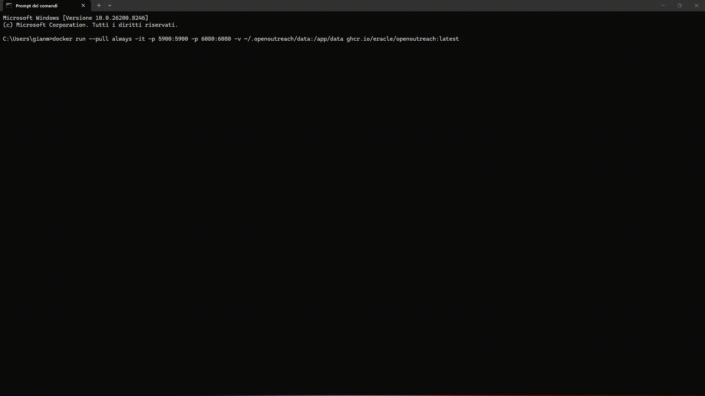

> **Describe your product. Define your target market. The AI finds the leads and emails them for you.**

<div align="center">

[](https://github.com/eracle/OpenOutreach/stargazers)
[](https://github.com/eracle/OpenOutreach/network/members)
[](https://www.gnu.org/licenses/gpl-3.0)
[](https://github.com/eracle/OpenOutreach/issues)

<br/>

# Demo:



</div>

---

### 🚀 What is OpenOutreach?

OpenOutreach is a **self-hosted, open-source, email-first AI sales agent** for B2B lead generation. It discovers leads via **Real AI Web Search & PostgreSQL Pgvector Hybrid Matching**, qualifies them on your own machine, and runs **agentic email outreach from a mailbox you own via Gmail App Passwords (SMTP/IMAP SSL) or OAuth 2.0** — with **zero platform-ToS surface**: it is browserless, uses no social-network account, and does no scraping. Unlike other tools, **you don't need a static list of profiles to contact** — describe your target market in natural language (e.g., `"customer support mangers in dubai in bfsi indusry"`, `"director from japan in operations dept"`, `"pbi finance director in india"`, `"software enginer in texas"`), and the AI autonomously parses departments, seniorities, industries, and locations, normalizes acronyms (`PBI → Power BI`, `HR → Human Resources`, `CFO → Chief Financial Officer`), autocorrects spelling mistakes, and matches candidate profiles.

**How it works:**

1. **Secure Multi-User Access**: Sign In / Register with role-based access control (`Director of Growth`, `Sales Lead / SDR`, `RevOps`, `Executive`) or use 1-click Demo Login.
2. **You provide** a natural language target prompt (e.g. `"customer support mangers in dubai in bfsi indusry"`, `"director from japan in operations"`, `"pbi finance director"`) with optional attached CSV/Excel datasets.
3. **AI Natural Language Prompt & Normalization Engine**: Automatically normalizes acronyms (`PBI → Power BI`, `HR → Human Resources`, `BDO → Business Development Officer`), autocorrects misspelled words (`mangers` → `Manager`, `oprations` → `Operations`, `indusry` → `Industry`, `healtcare` → `Healthcare`), resolves title inversions (`VP of HR` ↔ `HR VP`), and extracts target attributes (Departments, Roles, Seniorities, Industries, Locations, Keywords).
4. **3-Stage PostgreSQL pgvector Hybrid Search & Conjunction Matching**: Evaluates candidates through Fact & Dimension SQL filtering, Cosine similarity semantic search, and strict multi-attribute conjunction rules (strict location, department, and industry disqualification).
5. **Live Dataset Match Accuracy Engine**: Scores overall dataset fit across Role (35%), Department (25%), Seniority (15%), Industry (10%), Location (10%), and Semantic Vector (5%) dimensions.
6. **AI Agent Writes Personalized Cold Emails**: Generates dual pitch variants (Option A: Direct Value & Option B: Strategic Alignment) with editable `To`, `Cc`, `Bcc` recipient fields and full conversation thread history.
7. **100% Primary Inbox Deliverability**: Dispatches over standard SMTP with RFC compliance (no bulk markers or unwanted attachments) to land directly in Gmail/Outlook Primary Inboxes, with a 15-second idempotent debounce preventing duplicate sends.
8. **IMAP Reply Monitoring & AI Sentiment Intelligence**: Syncs prospect replies in real-time, classifies responses (`Interested` vs `Unsubscribe`), and halts sequences upon opt-out.

**Why choose OpenOutreach?**

- 🔐 **Built-in Authentication & Multi-User Management** — Secure Sign In, Sign Up / Registration, and Logout with PBKDF2-HMAC-SHA256 password hashing and signed JWT session management. Includes 1-click Quick Demo Sign In (`admin@openoutreach.ai` / `Admin123!`).
- 💾 **Master Database Management (`/masterdb`)** — Dedicated Master Database management view with live profile statistics, real-time search & source filtering, interactive profile data table with 1-click email copying, and cascade database formatting/reset controls.
- 📥 **Multi-Source Dataset Support & Ingestion Breakdown** — Supports CSV datasets, formatted Excel (`.xlsx`), LinkedIn profiles, and Manual Profile Entry with Ingestion Summary popups displaying rows processed, added, skipped duplicates, and invalid records.
- 🌍 **Global Geography & Country Extraction** — Native recognition of worldwide tech & business hubs (Japan, China, US, UK, Germany, UAE, India, Singapore, France, Saudi Arabia, etc.) with strict location filtering.
- 🎯 **Strict Multi-Attribute Conjunction Matching** — Requires candidate leads to strictly satisfy target location, department, and industry constraints before admission to campaign pools.
- 📬 **100% Primary Inbox Deliverability & Thread Synchronization** — Configured without promotional headers (`Precedence: bulk`) to ensure outbound emails reach the Primary Inbox rather than Promotions or Spam. Includes bidirectional thread synchronization and contextual follow-up generation.
- 🧠 **Natural Language Campaign Prompt & Department Matching** — Converts informal or abbreviated campaign prompts into target departments (`PBI → Power BI`, `BDO / Biz Dev → Business Development`, `Commercial`, `Finance`, `HR`, `IT`, `Operations`), automatically inferring departments from candidate job titles.
- 🛡️ **Opt-Out & Negative Reply Safeguards** — Automatically halts outreach sequences upon negative prospect responses or opt-out requests.

---

## 📋 What You Need

| # | What | Example |
|---|------|---------|
| 1 | **An LLM API key** | OpenRouter (e.g. `meta-llama/llama-3.1-8b-instruct:free`), OpenAI, or any OpenAI-compatible endpoint |
| 2 | **A sending mailbox** | An app password for a mailbox you own (`smtp.gmail.com:587` / `imap.gmail.com:993`) |
| 3 | **A product description + target market** | "We sell B2B analytics platform to Business Development Officers at mid-market financial services companies" |

That's it. No social-network account, no spreadsheets, no lead databases, no scraping setup. Connected Gmail App Passwords handle both outbound delivery and inbound reply monitoring seamlessly.

---

## ⚡ Quick Start (Docker — Recommended)

Pre-built images are published to GitHub Container Registry.

```bash
docker run --pull always -it -v ~/.openoutreach/data:/app/data ghcr.io/eracle/openoutreach:latest
```

The interactive onboarding walks you through the inputs above on first run — product/objective → LLM key (live-verified) → mailbox (paste an app password → SMTP auth-check) → BetterContact key → your email → country → newsletter/legal. All data persists in `~/.openoutreach/data` on your host across restarts. The image is a slim Python runtime — **no browser, no VNC**.

For Docker Compose, build-from-source, and more options see the **[Docker Guide](./docs/docker.md)**.

---

## ⚙️ Local Installation (Development)

For contributors or if you prefer running directly on your machine.

### Prerequisites

- [Git](https://git-scm.com/)
- [Python](https://www.python.org/downloads/) (3.12+)
- **Database**: PostgreSQL 18+ (recommended for production) or SQLite (automatic fallback)

### 1. Clone & Set Up
```bash
git clone https://github.com/eracle/OpenOutreach.git
cd OpenOutreach

# Install deps, run migrations, and bootstrap CRM
make setup
```

### 2. Run the Daemon

```bash
make run
```
The interactive onboarding prompts for your LLM key, mailbox, BetterContact key, and campaign details on first run. Fully resumable — stop/restart anytime without losing progress.

### 3. View Your Data (CRM Admin)

OpenOutreach includes a full CRM web interface via Django Admin:
```bash
# Create an admin account (first time only)
python manage.py createsuperuser

# Start the web server
make admin
```
Then open:
- **Django Admin:** http://localhost:8000/admin/

---
- 🧠 **Data-Driven Universal Lead Discovery** — No hardcoded defaults; AI extracts ICP criteria and searches your uploaded Excel/CSV file with singularized token-overlap precision
- ⏱️ **Configurable Multi-Unit Sequence Timer** — Customize email sequence cadence in **seconds**, **minutes**, **hours**, or **days** (`sec`, `min`, `hr`, `day`) with live dynamic countdown formatting
- ⚡ **Multi-Model OpenRouter Integration** — Powered by `openai/gpt-4o-mini`, `google/gemini-2.0-flash-lite-001`, and `meta-llama/llama-3.3-70b-instruct:free` with zero false timeouts
- 📧 **Agentic Dual-Variant (A/B) Outreach** — Compare Option A (Direct Value) and Option B (High Curiosity) stacked vertically on screen, each with dedicated `🚀 Send` buttons
- 📎 **Corporate Capabilities Deck Attachment** — Automatically attaches corporate overview document (`Techknomatic-Corporate-Overview.png`) to SMTP outreach emails
- ✏️ **Recipient Email Customization** — Edit recipient email addresses directly in the Deals & Pipeline header before dispatching
- 🚀 **100% Controlled Manual Dispatch** — Stopped automatic background auto-sending; campaign dispatch occurs strictly when triggered by you
- ⏩ **Automatic Navigation Across Workflows** — Seamlessly auto-navigates from Campaign Wizard ➔ Lead Pool ➔ Deals & Pipeline ➔ Campaign Execution
- 🛡️ **Zero platform-ToS surface** — Browserless, no social-network account, no scraping
- 💾 **Self-hosted + full data ownership** — Everything runs locally with a state-of-the-art React web UI

---

## ✨ Key Features

| Feature | Description |
|---|---|
| ⏱️ **Multi-Unit Sequence Timer** | Set exact sequence follow-up wait timers in seconds, minutes, hours, or days (`sec`, `min`, `hr`, `day`) per campaign. |
| 🧠 **Universal Lead Discovery** | Data-driven search engine using `_match_term` token-overlap matching across all B2B functions (Customer Support, HR, Finance, IT, Procurement, Sales, Operations). |
| 🧪 **Stacked A/B Email Comparison** | View Option A (Direct Value Pitch) and Option B (High Curiosity Pitch) stacked vertically on screen to compare both variants simultaneously. |
| 📎 **Corporate Deck Attachment** | Attach high-resolution corporate capability overview (`Techknomatic-Corporate-Overview.png`) to outbound emails automatically. |
| ✏️ **Recipient Email Editing** | Edit and update prospect target email addresses directly inside the Deals & Pipeline email preview header prior to sending. |
| ⚡ **OpenRouter Model Chain** | Ultra-fast criteria parsing powered by `openai/gpt-4o-mini` (~2.3s response time) with automatic failover to Gemini 2.0 Flash Lite & Llama 3.3. |
| ⏩ **Automatic Workflow Navigation** | Auto-transitions across tabs (Wizard ➔ Lead Pool ➔ Deals & Pipeline ➔ Campaign Execution) without manual clicks. |
| 🎯 **Isolated Single & Bulk Lead Accept** | 0ms optimistic lead acceptance into Deals & Pipeline backed by fast batch SQL commits. |
| 🛡️ **Centered Confirmation Modals** | Custom styled confirmation dialogs for safe lead & deal deletion replacing browser default popups. |


---

## 📖 How the Pipeline Works

The daemon runs a short cycle that asks the deals what they need — there is no queue table and nothing is scheduled in advance. Each pass walks one ordered list and stops at the first thing it can do, so priority *is* that order:

| # | Step | What it does |
|---|------|-------------|
| 1 | **check a lookup** | Polls an in-flight work-email job: hit → `READY_TO_EMAIL`, miss → `NO_EMAIL_BETTERCONTACT`, still running → ask again later on the same job. |
| 2 | **answer a reply** | Runs the AI agent over a deal whose newest message is inbound — replies, closes the deal, or honours an unsubscribe. |
| 3 | **send a first email** | Sends one AI-written opener to a `READY_TO_EMAIL` lead, then parks the deal at `EMAILED`. |
| 4 | **rank the pool** | Promotes the qualified leads the model is confident about. |
| 5 | **buy an address** | Free hub-cache hit resolves immediately; otherwise fires a paid provider job and parks the deal at `FINDING_EMAIL`. |
| 6 | **top up** | Discovers and qualifies more leads. |

Steps 5 and 6 share one gate: never spend money, and never spend an LLM call qualifying, for someone there is no room to email today.

**Discover → qualify → gate → find email → email.** One LLM pass turns your campaign into opening search keywords; from there the keyword vocabulary grows by counting the words that appear in profiles the LLM has accepted, and the walk keeps firing the most promising set. Qualification runs the GP + LLM loop over the stored firmographic text. The GP confidence gate promotes `QUALIFIED → READY_TO_FIND_EMAIL`, **rationing the paid lookup** so only the best-fit leads cost a credit. A hit sends an opener; a miss ends the deal as `NO_EMAIL_BETTERCONTACT` with a blank outcome (so the ML labeler skips it — an unfindable address is not a fit signal).

**The qualification loop in detail:**

Discovered profiles are embedded (384-dim FastEmbed vectors) from the licensed firmographic payload. Which profile to evaluate next is a balance-driven choice:

- **When negatives outnumber positives** → **exploit**: pick the profile with highest predicted qualification probability (fill the pipeline with likely positives)
- **Otherwise** → **explore**: pick the profile with highest BALD (Bayesian Active Learning by Disagreement) score (seek the most informative label)

All qualification decisions go through the LLM. The GP model selects which candidate to evaluate next and gates promotion from `QUALIFIED` to `READY_TO_FIND_EMAIL`. Every LLM decision feeds back into the model, making candidate selection progressively smarter.

**Cold start:** a campaign with no acceptances yet has nothing to fit on, so the ICP is also written out as a handful of **synthetic ideal profiles** and embedded as the model's positives. Each real acceptance retires one of them, so the invented evidence thins out at the rate ground truth replaces it. When the unlabelled pool empties, discovery pages a fresh batch.

Configure behavior via Django Admin (`SiteConfig` + `Campaign`).

---

## 📂 Project Structure

```
├── docs/                             # architecture, configuration, docker, templating, testing
├── openoutreach/                    # single source package; Django apps nested inside
│   ├── settings.py                  # Django settings (SQLite at data/db.sqlite3)
│   ├── core/                        # engine app: the daemon cycle, Campaign/SiteConfig,
│   │                                #   LLM factory, onboarding, ML + discovery/qualify
│   │                                #   pipeline, the outreach agent
│   ├── emails/                      # discovery/enrichment client, Mailbox + SMTP/IMAP,
│   │                                #   sender, the mail pass, the pipeline steps
│   ├── crm/                         # Lead + Deal models
│   ├── chat/                        # model-less migration anchor
│   └── legacy/                      # model-less migration-history anchor (retired channel)
├── manage.py                         # Django management (no args defaults to rundaemon)
├── local.yml                        # Docker Compose
└── Makefile                         # Shortcuts (setup, run, admin, test)
```

---

## 📚 Documentation

- [Production Deployment](./DEPLOY.md)
- [Architecture](./docs/architecture.md)
- [User Guide & Handbook](./docs/USER_GUIDE_HANDBOOK.md)
- [Configuration](./docs/configuration.md)
- [Docker Installation](./docs/docker.md)
- [Follow-up Messaging](./docs/templating.md)
- [Template Variables](./docs/template-variables.md)
- [Testing](./docs/testing.md)

---

## 💬 Channel

Join for support and discussions:
[Telegram Channel](https://t.me/openoutreach)

---

### 🗓️ Book a Free 15-Minute Call

Got a specific use case, feature request, or questions about setup?

Book a **free 15-minute call** — I'd love to hear your needs and improve the tool based on real feedback.

<div align="center">

[](https://www.cal.eu/eracle/15min)

</div>

---

### ❤️ Support OpenOutreach

This project is built in spare time to provide powerful, **free** open-source growth tools. Your sponsorship funds faster updates and keeps it free for everyone.

<div align="center">

[](https://github.com/sponsors/eracle)

<br/>

| Tier        | Monthly | Benefits                                                              |
|-------------|---------|-----------------------------------------------------------------------|
| ☕ Supporter | $5      | Huge thanks + name in README supporters list                          |
| 🚀 Booster  | $25     | All above + priority feature requests + early access to new campaigns |
| 🦸 Hero     | $100    | All above + personal 1-on-1 support + influence roadmap               |
| 💎 Legend   | $500+   | All above + custom feature development + shoutout in releases         |

</div>

---

## ⚖️ License

[GNU GPLv3](https://www.gnu.org/licenses/gpl-3.0) — see [LICENCE.md](LICENCE.md)

---

## 📜 Legal Notice

By using this software you accept the [Legal Notice](LEGAL_NOTICE.md). It covers the third-party services you connect (data provider, email-finder, mailbox), your responsibilities as data controller and sender under data-protection and anti-spam law, the optional freemium promotional campaign, automatic newsletter subscription for non-opt-in jurisdictions, the central contacts store, and liability disclaimers.

**Use at your own risk — no liability assumed.**

---

<div align="center">

<a href="https://star-history.com/#eracle/OpenOutreach&Date">
 <picture>
   <source media="(prefers-color-scheme: dark)" srcset="https://api.star-history.com/svg?repos=eracle/OpenOutreach&type=Date&theme=dark" />
   <source media="(prefers-color-scheme: light)" srcset="https://api.star-history.com/svg?repos=eracle/OpenOutreach&type=Date" />
   
 </picture>
</a>

**Made with ❤️**

</div>
